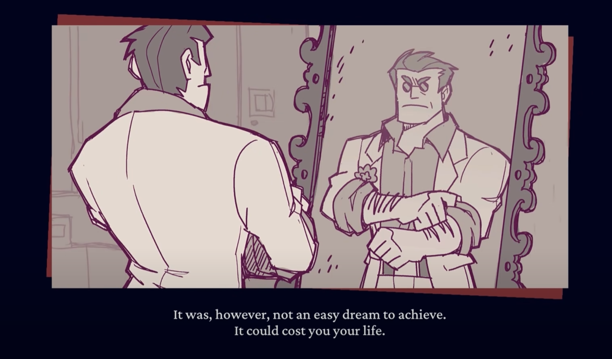
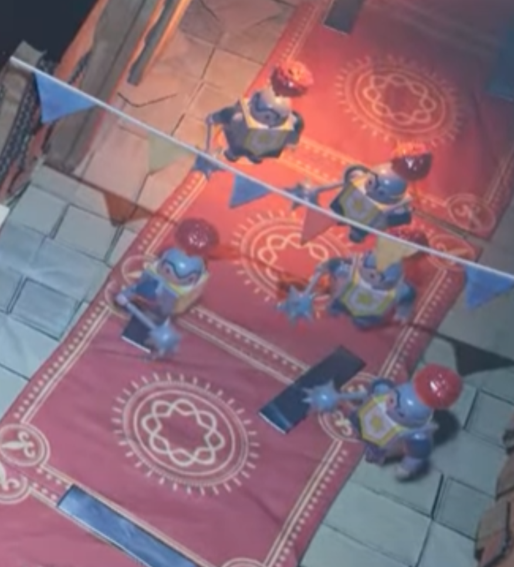
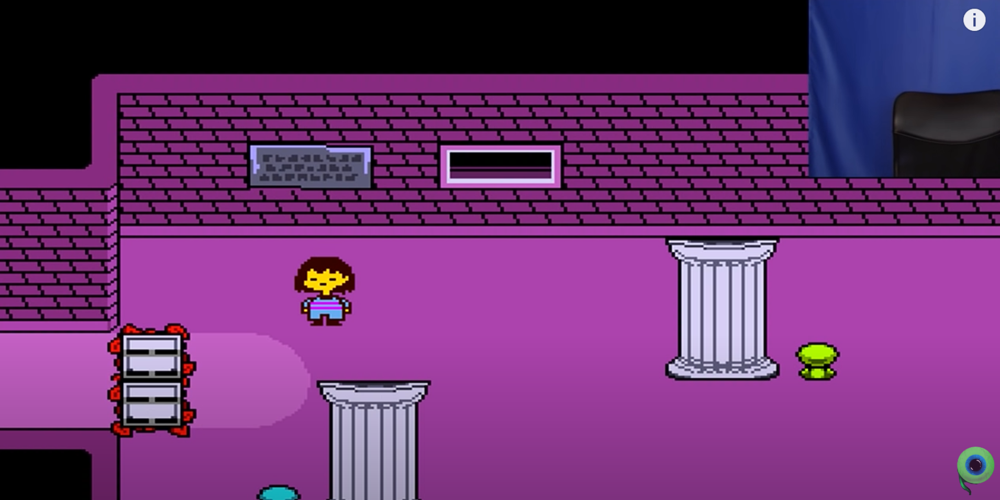
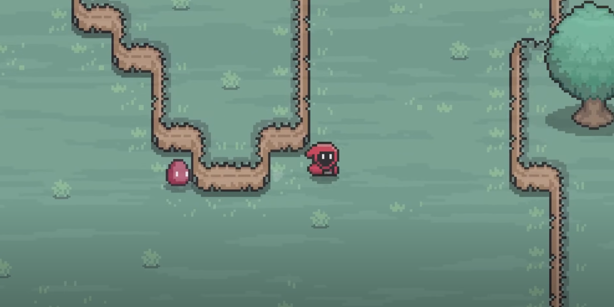
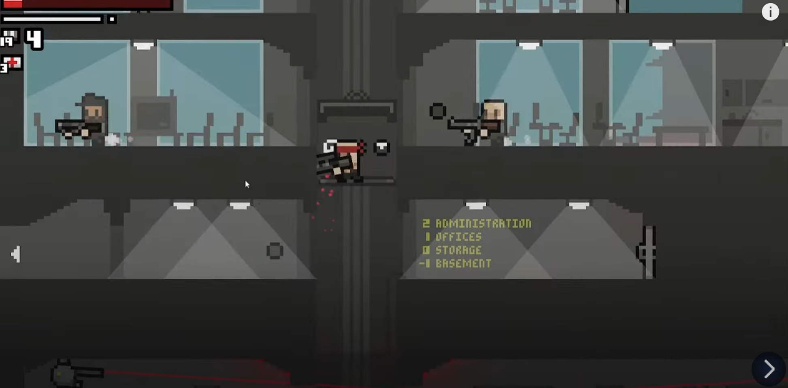
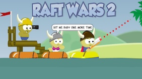
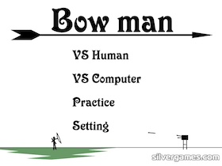
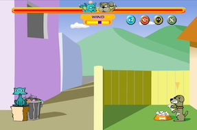

# Software Engineering - Group 15

## Team

Yining Xu, Li-Hshin Chien, Ada Liang, Louis Nutt-Wilson, Xinyu Hu

## Introduction

Our game is a two-player game based on a flash game *Bowman*.
Normally, the game-play is that players drag the mouse to pull back the bow and shoot, then a camera will follow the arrow to check whether you have shot the target.

We've transformed the game into a space-themed version by introducing a gravity engine to calculate gravity between planets as well as special functions like pathfinder to enhance the original game-play.
[add more things]

## Requirements

### Ideation Process

We have two game ideas at the beginning proposed by two of our team members, which are the two-player bowman game with camera movement and gravity physical engine, and a RPG-like two-player game with storyline, interactions with the environment and boss fights.

We used paper prototype to mock the outline of these two game's workflow in class to grasp concepts of each. Soon after the mock and discussions, we collectively decided to pursue the *Bowman* game due to its more specified enhancement and requirements, and its solid gameplay foundation.

### User Stories

>"As a player, I want to have personalize choices at the start of the game so that I can choose the game's difficulty based on my preferences."  
>"As a player, I want to gain resources through some special behaviours in the game, and these resources can be able to trade for special skills, so it is bit more fun."  
>"As a player, I want to know the force and the direction of my arrow, so I need a sign to acknowledge that."  
>"As a second player, I want to be able to play the game with my friends, so that I can have fun with two players other than play against the computer."  
>"As a player, I want to have cases or tutorial examples telling me some of special designs of the game."  
>"As a player, I want a skip function to skip the animation, so that I can get the result immediately."  
>"As a marker for this project, I want to see groups create engaging and well made games, with a strong process of development that utilises the techniques taught in this module."  
>"As a future group for this module, we want to see good examples of games which will inspire us when creating our own game."  

### Use-case diagram

### Use-case specifications

**Use-Case Specification**

*Easy Mode*

| Use-Case Section     | vs Human                                                                                                                                                                   | vs Computer   |
|----------------------|----------------------------------------------------------------------------------------------------------------------------------------------------------------------------|----|
| **Description**      | A run through of the game on easy mode                                                                                                                                     | A run-through of the game on easy mode, against a computer |
| **Basic Flow**       | Two players compete to get a higher score to win the game with no one losing all of his health points.                                                                     | The player and the computer compete to get a higher score to win the game, with neither losing all of their health points. |
| 1.                   | Each user presses the left mouse button, drags the mouse to determine the strength and direction, and releases the mouse to shoot. Each player can take one shot each turn. | The player presses the left mouse button, drags the mouse to determine the strength and direction, and releases the mouse to shoot. The player and the computer can take one shot each turn. The actions of the computer in these aspects are automated. |
| 2.                   | The user who is shot will lose his health points.                                                                                                                          | The player and the computer lose health points when shot. |
| 3.                   | The users can collect weapons and skills by shooting the stars.                                                                                                            | The player can collect weapons and skills by shooting the stars, while the computer's actions are automated. |
| 4.                   | The users can adjust their position by pressing A and D.                                                                                                                   | The player can adjust position by pressing A and D, and the computer will automatically make adjustment of its position. |
| 5.                   | The number of rounds will decrease after each user takes a shot.                                                                                                           | The number of rounds will decrease after each side takes a shot. |
| 6.                   | The number of rounds decrease to 0 and the result is shown with the option to try again.                                                                                   | The number of rounds decrease to 0 and the result is shown with the option to try again. |
| **Alternative Flow** |                                                                                                                                                                            |    |
| 1.                   | Each user presses the left mouse button, drags the mouse to determine the strength and direction, and releases the mouse to shoot. Each player can take one shot each turn. | The player presses the left mouse button, drags the mouse to determine the strength and direction, and releases the mouse to shoot. The actions of artificial intelligence in these areas are automated. The player and artificial intelligence can take one shot each turn. |
| 2.                   | The user who is shot will lose his health point.                                                                                                                           | The player and the computer lose health points when shot. |
| 3.                   | The users can collect weapons and skills by shooting the stars.                                                                                                            | The player can collect weapons and skills by shooting the stars, while the computer's actions are automated. |
| 4.                   | The users can adjust their position by pressing A and D.                                                                                                                   | The player can adjust position by pressing A and D, and the computer will automatically make adjustment of its position. |
| 5.                   | The number of rounds will decrease after each user takes a shot.                                                                                                           | The number of rounds will decrease after each side takes a shot. |
| 6.                   | The user has lost all of his health points within 10 rounds and the result is shown with the option to try again.                                                          | The player has lost all of the health points within 10 rounds and the result is shown with the option to try again. |

*Difficult Mode*

| Use-Case Section                        | vs Human                                      | vs Computer                                                                                                     |
|-----------------------------------------|-----------------------------------------------|-----------------------------------------------------------------------------------------------------------------|
| **Description**                         | A run through of the game on hard mode        | 1 player run through of the game on hard mode, against a computer                                               |
| **Basic Flow**                          | Shoot your opponent until his/her HP becomes zero                    | Shoot the computer until its HP becomes zero, or your own becomes zero                                          |
| 1.                                      | Players can choose their own planet, each planet has different gravity | Players can choose their own planet, each planet has different gravity                                          |
| 2.                                      | LEFT-CLICK and drag the mouse to control throwing power and angle (User can choose to hit the star or opponent) | LEFT-CLICK and drag the mouse to control throwing power and angle (User can choose to hit the star or opponent) |
| 3.                                      | May appear strong wind and change the trajectory of the arrow         | ay appear strong wind and change the trajectory of the arrow                                                    |
| 4.                                      | Hit opponent, their HP will be reduced [A1, A2, A3]                    | Hit opponent, their HP will be reduced [A1, A2, A3]                                                             |
| 5.                                      | Change sides                                  | Change sides, computer will take their turn                                                                     |
|                                         |                                               |                                                                                                                 |
| **Alternative Flow**                    |                                               |                                                                                                                 |
| A1                                      | 1. Hit a star, skill points will increase                                |                                                                                                                 |
|                                         | 2. Back to Basic Flow 5.                    |                                                                                                                 |
| A2                                      | 1. Hit a star, star becomes black hole                                    |                                                                                                                 |
|                                         | 2. No skill points will be added                                       |                                                                                                                 |
|                                         | 3. Back to Basic Flow 5.                    |                                                                                                                 |
| A3                                      | 1. Hit the ground                            |                                                                                                                 |
|                                         | 2. The ground breaks                        |                                                                                                                 |
|                                         | 3. Back to Basic Flow 5.                    |                                                                                                                 |
=======

### Early Stage Design

We sat down and brainstormed about additional content ideas beyond the original concept, as well as any potential problems that might arise during the  game development progress.

Then we discussed about what to implement and used Kanban Board to assign tasks and track the progress of our work and timely updated information into our chat group.

#### Core Gameplay

The core game flow will be, the game starts and players can choose from whether this is "VS Computer" mode or "VS Human" mode, and self-defined the rounds and HP that each player should have.

Users' input mainly comes from mouse move and click, including aiming, selecting in the shops and so on. So when it becomes this player's turn:

1. The player will select from *Move* and *Shop*. *Move* will allow the player to move around the whole planet, and *Shop* will provide skills like *pathfinder*, *double strike* for the player to select. 

2. After that, the player click and drag mouse to control the bow's tension and direction, and then release the mouse to fire. The camera will then focus on the arrow until it shot on any bounding shape.

Additionally, we want to introduced a points collection system to raise the shop system where players can buy some skills. How the gravity works was also being discussed. There are proposals like whether to do a half and half screen where one side has negative gravity or use the escape velocity formula for planets, we choosed the latter eventually.

#### Obstacles

The first obstacle that might occur is the gravity calculation methods that involve physics. So we should take a look into the escape velocity formula for planets, luckily we only have two planets and one object to model.

Another barrier is the camera zoom in or zoom out function. The core design is that the other player's position is invisible in this player's turn. So the camera should keep this player at the center of the screen and move follows the arrow after firing.
[AI player???]

#### TODO list

After putting all the designs and concerns on the table, we wrote a TODO list to guide the step-by-step development of the whole game.

The highest priority tasks include implementing the physics engine to calculate gravity and 2D bounding collision detection, and the camera movements as well. Then we will add the shop system, the HP detection, tutorials and any other things.

## Design

### Class diagram

We use the class diagram to help us understand the structures of the system at the very first stage. During the later development process some methods and class might be added or deleted but the main idea remains to our final stage.

We defined the *App* class as the main class that initialization and constantly being called and updated during the whole game progress. Also, we used the *Obj* class as the parent class of *Arrow*, *Pathfinder*, *Planet*, *Player* and so on as they share the same position at some point.

 

### Modelling behaviour: Communication diagrams

To more clarify the relationships between the classes of the system, we use the communication diagram to help us specify the interactions between classes. This diagram has gived us more detailed insights how classes communicate.

Normally, after the mouse drag and release, the *Amier* will update the tension and direction to *Arrow*, then the *Camera* will move to follow wherever the arrow goes. Also, the position and movement of the arrow will update the *Planet* to calculate the gravity of the arrow to define its movement in next frame. Ultimately all the information will be updated in the *App*, the main class to puruse any further movements.

### Design Conclusion

Although the final product might be slightly different from our original design, we still find it really useful to introduce these two diagrams to help us understand the relationships and interactions of the entire system.

Furthermore, these design prototypes help us to focus on one function to implement, one class to code at a time, greatly simplify the progress of coding and debugging in later development.

## Implementation

[three areas of challenging]-[needed simplify to under 750 words...]

### 1. Camera movement:
  
In bowman and raft wars, the camera moves with the projectile so the shooting player cannot see exactly where they need to hit.

To display the whole scene when entering the game to let the players know the approximate position of each other, just set the camera at the center of the two randomly-generated planets' positions. Then the camera will apply to the player's center position.

To place the player at the center of the screen in this person's turn, we used the status to track if the arrow is fired or not, if it is, the camera will update with the position of the arrow until the collision detection is true.

We also implemented zoom functions to dynamically adjust the camera's scale based on the game status using stack to push and pop zoom scale which allows the camera to switch from any game status. We also used *Linear Interpolation* and frames related functions to make the camera's movements smoother.

As bunded with the camera movements after firing, we added texts to display the distance that the arrow has flown and magnification related to the points system.

[demonstration video]

### 2. Gravity engine:

Gravity mechanics would need to be implemented for this idea (as it is set in space) and the balance between realism and difficulty would need to be found. Also, we need to set hit boxes to detect collision and change further status.

We used the *PVector* (a built-in class in Processing to handle operations on 2D and 3D dimensions' vectors) to handle the vector. In the *Planet* class the *Law of Universal Gravitation* is used to calculate the gravity vector of the arrow (with constraints avoiding any extreme situations), then update the acceleration of each planets and added it to current velocity to modify any further movement of the arrow in the *Entity* class.

As for collision detection, we used self-defined hitboxes of planets, players and arrows and calculate the distance among objects to detect any collision.

### 3. AI enemy:

[The gameplay additions can be the third challenges? ]

### 4. Gameplay additions:
Other from the three main challenges, we also added some interesting functions that worth mentioning:

1. Shops:  
 
Initially, we made a pathfinder for debugging which provides a dotted curve line of the arrow's detected movements. It stored every X and Y positions at the maxium of 200 with pre-calculation of its movements with current velocity, mouse-controlled force and gravity vector of each planets, and printed them out with dots.

Moreover, we further broadened the shop system by adding "Health Potion", "Double Strike", "Hit and Skip" functions and its detailed messages. These functions related to players' turn and HP bar so it's quite easy to implement.

2. Points Systems:
  
At the outset, we used the arrow numbers on planets as "points" to trade for skills in the shop.
Then we thought about linked the magnification to the rotation of the arrow and multiple it to a score when the arrow hit the other player.

To implement this, we defined the *rotationAmount* in the *Arrow* Class, and update the absolute value of current degree minus previous angle. Then we used the amount to calculate the magnification and updated it in every frame of the arrow's movements.

Additionally, we added the *PointsSplash* to add visual effects. It will have a animation to right or left if the arrow is detected collision on players and adds to the current points, and move down if the arrow fail to hit anyone. This is implemented by setting the positions of magnificationText and pointsText.

3. Moving around the planets:

The *PlayerMover* class is added to let the player move around the planet.
By clicking on the circular area with the same radius as the planet, we can then calculate the angle between the current and selected positions based on the mouse click.
Then the angle is used for animating the player's movement to the selected position.

4. Tutorials:

During the first heuristic analysis we have received complaints about being confused of operations so we thought about adding some tutorial contents.

At first, we managed to add a tutorial content that is shown all the way during the gameplay at the left-down side of the screen.

Then we extended the tutorial mode at the game main page. An Arraylist was used to store all the tutorial messages and each boxed was selected and printed to inform the player what to do, and we created a class named *GUI* to draw any GUI-related contents on the screen.

## Evaluation

We segmented this section into two components: **Qualitative Analysis** and **Quantitative Analysis**. Employing these analyses throughout our development phase facilitated the identification and resolution of various issues such as user interface, user experience, and game logic.

### 1. Qualitative Analysis 

For this section, Heuristic Analysis was selected as the evaluation method. The analysis was conducted in two stages: Stage 1, during the early development phase, and Stage 2, during the later development stage following Easter. The dual-stage approach was implemented to capture shortcomings and subsequent improvements throughout the process.

#### Stage 1: Heuristic Analysis (11/03/24)

| Interface        | Issue                                                                               | Heuristic(s) | Frequency (0-4) | Impact (0-4, easy-difficult) | Persistence (0-4, once-repeated) | Severity=AVG(Freq+Impact+Persistence) |
|------------------|-------------------------------------------------------------------------------------|--------------|-----------------|------------------------------|----------------------------------|---------------------------------------|
| UI               | visually unclear  | 1, 3, 10     | 4               | 3                            | 4                                | 3.66                                  |
| Arrow (Obj)      | arrow hitbox glitches sometimes                                                     | 2, 7         | 1               | 2                            | 2                                | 1.66                                  |
| Game Logic (App) | game flow is unclear                                                                | 1, 3, 10     | 3               | 3                            | 1 (when learning)                | 2.33                                  |
| Camera           | camera movement with arrow keys doesn't make sense                                  | 4     | 1               | 4                            | 1                                | 2                                     |

In our early development stage, we identified the visual clarity of the user interface as the most prominent issue. This included a lack of indication for Player 1 and Player 2, unclear instructions on gameplay, and the absence of a start page and navigation page essential for a comprehensive gaming experience. 

Additionally, the unclearance in the game flow emerged as another significant issue. The player often get lost when learning how to play the game and the main cause of the issue is related to the UI design problem mentioned above. Both issues violated the principle of *visibility of system status*, *user control and freedom* and *help and documentation* in Heuristics Evaluation.

Moreover, issues with arrow mechanics and camera functionality also impacted usability. Arrows occasionally passed through players without inflicting damage, indicating glitches in the arrow hitbox, categorized under the principles of match between system and real world and flexibility and efficiency of use. Additionally, the camera movement via arrow keys was unnecessary. In our initial design, the random positioning of planets in each game meant that players might not always see their opponent. Allowing users to control the camera with arrow keys violated the principle of *consistency and standards*, as it disrupted established norms within the game environment.

#### Stage 2: Heuristic Analysis (13/04/24)

| Interface        | Issue                                                                               | Heuristic(s) | Frequency (0-4) | Impact (0-4, easy-difficult) | Persistence (0-4, once-repeated) | Severity=AVG(Freq+Impact+Persistence) |
|------------------|-------------------------------------------------------------------------------------|--------------|-----------------|------------------------------|----------------------------------|---------------------------------------|
| Game Logic               | cannot skip tutorial or exit during the game | 1, 3     | 2               | 1                            | 4                                | 2.33                                  |

During stage 1 and stage 2, we have solved all the issues occured in stage 1 table. After the second Heuristic Anaysis, one more issue related to game logic was found. During the game or tutorial, the system didn't provide any skip or exit button, which broke the principle of *visibility of system status* and *user control and freedom*.

Overall, our experience with Heuristic Analysis proved invaluable to the development process. After pinpointing issues within the game, this method provided a comprehensive evaluation of usability, allowing us to concentrate our efforts on specific principles for improvement. Moreover, the severity indication, determined by frequency, impact, and persistence, enabled us to prioritize issues effectively, addressing those with the highest importance promptly.

### 2. Quantitative Analysis 

**NASA TLX** and **System Usablility Survey (SUS)** were conducted in this part. Each analysis was divided into stage 1 (18/03/24) and stage 2. For the NASA TLX, both the easy mode and hard mode were individually tested in each stage of development. However, for the SUS, we conducted only one test in each stage since there was minimal difference in the user interface between the two modes.

NASA TLX is a multi-dimensional rating tool used to measure the workload a person experienced when performing a task. On the other hand, SUS is a reliable tool used to measure usability.

In stage 1, the main difference between easy mode and hard mode is whether the *pathfinder* is opened. As for stage 2, ...

#### Stage 1 (18/03/24)
**1. NASA TLX**

   * Easy mode
      > *Scores*
        >| Participant Number | Mental demand | Physical demand | Temporal demand | Performance | Effort | Frustration |
        >| ----------- | ------- | ------- | ------- | ------- | ------- | ------- |
        >| 1 | 60 | 40 | 20 | 70 | 75 | 25 |
        >| 2 | 60 | 0 | 0 | 100 | 60 | 80 |
        >| 3 | 75 | 25 | 10 | 90 | 60 | 75 |
        >| 4 | 65 | 25 | 40 | 75 | 50 | 60 |
        >| 5 | 50 | 20 | 25 | 0 | 0 | 0 |
        >| 6 | 50 | 25 | 5 | 50 | 75 | 35 |
        >| 7 | 50 | 50 | 15 | 60 | 65 | 50 |
        >| 8 | 55 | 30 | 15 | 50 | 60 | 25 |
        >| 9 | 60 | 40 | 10 | 65 | 70 | 30 |
        >| 10 | 50 | 30 | 20 | 50 | 20 | 35 |
        >
      > *Final Scores*
        >| Participant Number | 1 | 2 | 3 | 4 | 5 | 6 | 7 | 8 | 9 | 10 |
        >| ------ | ------ | ------ | ------ | ------ | ------ | ------ | ------ | ------ | ------ | ------ |
        >| score | 48 | 50 | 56 | 53 | 16 | 40 | 48 | 39 | 46 | 34 |
        >

   * Hard mode
     > *Scores*  
        >| Participant Number | Mental demand | Physical demand | Temporal demand | Performance | Effort | Frustration |
        >| ----------- | ------- | ------- | ------- | ------- | ------- | ------- |
        >| 1 | 65 | 40 | 20 | 65 | 70 | 30 |
        >| 2 | 60 | 0 | 0 | 0 | 40 | 40 |
        >| 3 | 75 | 25 | 10 | 90 | 60 | 75 |
        >| 4 | 65 | 25 | 40 | 75 | 50 | 60 |
        >| 5 | 45 | 15 | 25 | 0 | 5 | 0 |
        >| 6 | 50 | 30 | 10 | 50 | 80 | 35 |
        >| 7 | 50 | 50 | 10 | 60 | 60 | 55 |
        >| 8 | 60 | 30 | 25 | 50 | 60 | 35 |
        >| 9 | 60 | 50 | 10 | 70 | 70 | 30 |
        >| 10 | 55 | 40 | 30 | 50 | 30 | 45 |
        >
      >
       > *Final Scores*
        >| Participant Number | 1 | 2 | 3 | 4 | 5 | 6 | 7 | 8 | 9 | 10 |
        >| ------ | ------ | ------ | ------ | ------ | ------ | ------ | ------ | ------ | ------ | ------ |
        >| score | 48 | 23 | 56 | 53 | 15 | 43 | 48 | 43 | 48 | 43 |
        >

> **Analysis between easy and hard mode**
> 
> During the game's development, we aimed to ensure users experienced noticeable differences between the easy and hard modes. To achieve this objective, we employed the Wilcoxon signed-rank test to determine whether the difference is significant or not. This tool allowed us to analyze the final scores of the NASA TLX in a rigorous and statistical manner. The decision to use the Wilcoxon signed-rank test was inspired by the approach adopted by the 2023-group-1 team.
>
> *Wilcoxon sign-ranked test*  
>Step 1: calculate the difference between NASA TLX score
  >| Easy Score | Hard Score | Difference (easy - hard)|
  >| ----- | ----- | ----- |
  >| 48 | 48 | 0 |
  >| 50 | 23 | 27 |
  >| 56 | 56 | 0 |
  >| 53 | 53 | 0 |
  >| 16 | 15 | 1 |
  >| 40 | 43 | -3 |
  >| 48 | 48 | 0 |
  >| 39 | 43 | -4 |
  >| 46 | 48 | -2 |
  >| 34 | 43 | -9 |
  >
>
>Step 2: sort and rank previous table by "difference"
  >| Rank |  Difference | Rank (after) |
  >| ---- | ---- | ---- |
  >| 1 | 0 | 2.5 |
  >| 2 | 0 | 2.5 |
  >| 3 | 0 | 2.5 |
  >| 4 | 0 | 2.5 |
  >| 5 | 1 | 5 |
  >| 6 | -2 | -6 |
  >| 7 | -3 | -7 |
  >| 8 | -4 | -8 |
  >| 9 | -9 | -9 |
  >| 10 | 27 | 10 |
  >
> The sum of the positive signed rank is 25 and the absolute sum of negative signed rank is 30. We selected the smaller one, 25, as our 'W' to compare with critical value. Next, 0.1 was chosen as the "Two-Sided Test &alpha;" value. Referring to the critical values table provided [here](https://sphweb.bumc.bu.edu/otlt/mph-modules/bs/bs704_nonparametric/BS704_Nonparametric6.html), our 'W' needed to be smaller than 11 to indicate a significant difference between the easy and hard modes. However, our 'W' was 25, which exceeded the threshold of 11. In essence, this suggests minimal difference between the easy and hard modes. Therefore, the outcome was not as anticipated, and we intend to address this in the next stage of development.

  

**2. SUS**

 > *Scores*
   >| Participant Number | like to use frequently | unnecessarily complex | easy to use | need technical support | functions well integrated | too much inconsistency | learn to use quickly | cumbersome to use | confident to use | need to learn a lot before using |
   >| ----------- | ------- | ------- | ------- | ------- | ------- | ------- | ------- | ------- | ------- | ------- |
   >| 1 | 4 | 1 | 4 | 2 | 5 | 1 | 4 | 1 | 4 | 1 |
   >| 2 | 2 | 1 | 3 | 1 | 5 | 1 | 3 | 1 | 3 | 1 |
   >| 3 | 3 | 5 | 2 | 5 | 4 | 2 | 2 | 4 | 1 | 3 |
   >| 4 | 3 | 4 | 2 | 4 | 4 | 3 | 4 | 3 | 2 | 2 |
   >| 5 | 5 | 1 | 5 | 2 | 5 | 1 | 4 | 1 | 5 | 1 |
   >| 6 | 5 | 1 | 5 | 1 | 5 | 1 | 3 | 1 | 3 | 3 |
   >| 7 | 3 | 1 | 1 | 2 | 5 | 1 | 4 | 1 | 4 | 2 |
   >| 8 | 2 | 4 | 2 | 5 | 2 | 3 | 2 | 4 | 4 | 4 |
   >| 9 | 3 | 3 | 1 | 2 | 3 | 3 | 2 | 4 | 4 | 3 |
   >| 10 | 1 | 3 | 2 | 4 | 3 | 2 | 4 | 3 | 3 | 4 |
   >
 > *Score contribution*
   >| Participant Number | like to use frequently | unnecessarily complex | easy to use | need technical support | functions well integrated | too much inconsistency | learn to use quickly | cumbersome to use | confident to use | need to learn a lot before using |
   >| ----------- | ------- | ------- | ------- | ------- | ------- | ------- | ------- | ------- | ------- | ------- |
   >| 1 | 3 | 4 | 3 | 3 | 4 | 4 | 3 | 4 | 3 | 4 |
   >| 2 | 1 | 4 | 2 | 4 | 4 | 4 | 2 | 4 | 2 | 4 |
   >| 3 | 2 | 0 | 1 | 0 | 3 | 3 | 1 | 1 | 0 | 2 |
   >| 4 | 2 | 1 | 1 | 1 | 3 | 2 | 3 | 2 | 1 | 3 |
   >| 5 | 4 | 4 | 4 | 3 | 4 | 4 | 3 | 4 | 4 | 4 |
   >| 6 | 4 | 4 | 4 | 4 | 4 | 4 | 2 | 4 | 2 | 2 |
   >| 7 | 2 | 4 | 0 | 3 | 4 | 4 | 3 | 4 | 3 | 3 |
   >| 8 | 1 | 1 | 1 | 0 | 1 | 2 | 1 | 1 | 3 | 1 |
   >| 9 | 2 | 2 | 0 | 3 | 2 | 2 | 1 | 1 | 3 | 2 |
   >| 10 | 0 | 2 | 1 | 1 | 2 | 3 | 3 | 2 | 2 | 1 |
   >
 > *Final Scores*
   >|  | 1 | 2 | 3 | 4 | 5 | 6 | 7 | 8 | 9 | 10 | Avg. |
   >| ------ | ------ | ------ | ------ | ------ | ------ | ------ | ------ | ------ | ------ | ------ | ------ |
   >| Score | 87.5 | 77.5 | 32.5 | 47.5 | 95 | 85 | 75 | 30 | 45 | 42.5 | 61.8
   >
 
 > **Analysis**
>  
 > Based on the five different SUS score interpretation methods outlined [here](https://measuringu.com/interpret-sus-score/), we opted for the "Adjective" method proposed by [Bangor et al](https://uxpajournal.org/determining-what-individual-sus-scores-mean-adding-an-adjective-rating-scale/). This approach categorizes SUS scores into seven adjective scales: worst imaginable, awful, poor, OK, good, excellent, and best imaginable. The SUS score of our system falls into the "OK" category. While this is an acceptable score for us, we would like to have further improvement in the next stage of development.
 
 

#### Stage 2 (?)

**1. NASA TLX**

 * Easy mode
    > *Scores*
      >| Participant Number | Mental demand | Physical demand | Temporal demand | Performance | Effort | Frustration |
      >| ----------- | ------- | ------- | ------- | ------- | ------- | ------- |
      >| 1 |  |  |  |  |  |  |
      >| 2 |  |  |  |  |  |  |
      >| 3 |  |  |  |  |  |  |
      >| 4 |  |  |  |  |  |  |
      >| 5 |  |  |  |  |  |  |
      >| 6 |  |  |  |  |  |  |
      >| 7 |  |  |  |  |  |  |
      >| 8 |  |  |  |  |  |  |
      >| 9 |  |  |  |  |  |  |
      >| 10 |  |  |  |  |  |  |
      >
    > *Final Scores*
      >| Participant Number | 1 | 2 | 3 | 4 | 5 | 6 | 7 | 8 | 9 | 10 | 
      >| ------ | ------ | ------ | ------ | ------ | ------ | ------ | ------ | ------ | ------ | ------ |
      >| score |  |  |  |  |  |  |  |  |  |  |
      >

 * Hard mode
    > *Scores*
      >| Participant Number | Mental demand | Physical demand | Temporal demand | Performance | Effort | Frustration |
      >| ----------- | ------- | ------- | ------- | ------- | ------- | ------- |
      >| 1 |  |  |  |  |  |  |
      >| 2 |  |  |  |  |  |  |
      >| 3 |  |  |  |  |  |  |
      >| 4 |  |  |  |  |  |  |
      >| 5 |  |  |  |  |  |  |
      >| 6 |  |  |  |  |  |  |
      >| 7 |  |  |  |  |  |  |
      >| 8 |  |  |  |  |  |  |
      >| 9 |  |  |  |  |  |  |
      >| 10 |  |  |  |  |  |  |
      >
    > *Final Scores*
      >| Participant Number | 1 | 2 | 3 | 4 | 5 | 6 | 7 | 8 | 9 | 10 |
      >| ------ | ------ | ------ | ------ | ------ | ------ | ------ | ------ | ------ | ------ | ------ |
      >| score |  |  |  |  |  |  |  |  |  |  |
      >

> **Analysis between easy and hard mode**  
> 
> *Wilcoxon sign-ranked test*  
  >Step 1: calculate the difference between NASA TLX score
   >| Easy Score | Hard Score | Difference (easy - hard)|
   >| ----- | ----- | ----- |
   >|  |  |  |
   >|  |  |  |
   >|  |  |  |
   >|  |  |  |
   >|  |  |  |
   >|  |  |  |
   >|  |  |  |
   >|  |  |  |
   >|  |  |  |
   >|  |  |  |
   >
>
  >Step 2: sort and rank previous table by "difference"  
   >| Rank |  Difference | Rank (after) |
   >| ---- | ---- | ---- |
   >| 1 |  |  |
   >| 2 |  |  |
   >| 3 |  |  |
   >| 4 |  |  |
   >| 5 |  |  |
   >| 6 |  |  |
   >| 7 |  |  |
   >| 8 |  |  |
   >| 9 |  |  |
   >| 10 |  |  |
   >
> -(Analysis result and conclusion)

**2. SUS**

  > *Scores*
   >| Participant Number | like to use frequently | unnecessarily complex | easy to use | need technical support | functions well integrated | too much inconsistency | learn to use quickly | cumbersome to use | confident to use | need to learn a lot before using |
   >| ----------- | ------- | ------- | ------- | ------- | ------- | ------- | ------- | ------- | ------- | ------- |
   >| 1 |  |  |  |  |  |  |  |  |  |  |
   >| 2 |  |  |  |  |  |  |  |  |  |  |
   >| 3 |  |  |  |  |  |  |  |  |  |  |
   >| 4 |  |  |  |  |  |  |  |  |  |  |
   >| 5 |  |  |  |  |  |  |  |  |  |  |
   >| 6 |  |  |  |  |  |  |  |  |  |  |
   >| 7 |  |  |  |  |  |  |  |  |  |  |
   >| 8 |  |  |  |  |  |  |  |  |  |  |
   >| 9 |  |  |  |  |  |  |  |  |  |  |
   >| 10 |  |  |  |  |  |  |  |  |  |  |
   >
 > *Score contribution*
   >| Participant Number | like to use frequently | unnecessarily complex | easy to use | need technical support | functions well integrated | too much inconsistency | learn to use quickly | cumbersome to use | confident to use | need to learn a lot before using |
   >| ----------- | ------- | ------- | ------- | ------- | ------- | ------- | ------- | ------- | ------- | ------- |
   >| 1 |  |  |  |  |  |  |  |  |  |  |
   >| 2 |  |  |  |  |  |  |  |  |  |  |
   >| 3 |  |  |  |  |  |  |  |  |  |  |
   >| 4 |  |  |  |  |  |  |  |  |  |  |
   >| 5 |  |  |  |  |  |  |  |  |  |  |
   >| 6 |  |  |  |  |  |  |  |  |  |  |
   >| 7 |  |  |  |  |  |  |  |  |  |  |
   >| 8 |  |  |  |  |  |  |  |  |  |  |
   >| 9 |  |  |  |  |  |  |  |  |  |  |
   >| 10 |  |  |  |  |  |  |  |  |  |  |
   >
 > *Final Scores*
   >|  | 1 | 2 | 3 | 4 | 5 | 6 | 7 | 8 | 9 | 10 | Avg. |
   >| ------ | ------ | ------ | ------ | ------ | ------ | ------ | ------ | ------ | ------ | ------ | ------ |
   >| Score |  |  |  |  |  |  |  |  |  |  | 
   >

> **Analysis**
> 
> -(Analysis result and conclusion)

---
## Process

### Teamwork

Initially, we had a rough idea of our requirements but were unsure about all the features to be implemented. We adopted the Agile development methodology and followed some of the Agile principles in our game development process in that it allows for more flexibility and adaptability. It enhances the efficiency of the development and offers us many opportunities for idea validation and incremental improvement.

We prioritise getting things done and delivering value, recognising that continuous improvement is better than striving for perfectionism. By breaking the development process into manageable parts, we develop each component of the game in short cycles. We continuously developed working features so that the codebase in the main branch always works. We then can receive timely feedback from the evaluators and make necessary adjustments to improve the quality of the game. Meanwhile, we followed a consistent coding standard and wrote meaningful comments. Therefore, the code is easy to understand for all of us.

### Collaboration Tools and Techniques

We utilised the following tools to facilitate effective collaboration and project management.

Before each sprint, we used Kanban boards on GitHub to have a visual overview of all the tasks and their current status. We prefer to keep things simple and organised in a single workspace, so we do not use other project management platforms. It worked well for us. After each meeting, we updated the tasks on the Kanban board. The urgency of tasks differs, and we focused on the most critical tasks first. For instance, we implemented gravity calculation and camera movement before adding a tutorial and animation. We planned the workload we could commit to using story points to estimate the efforts. Once we reached a consensus and the sprint began, no additional tasks were added. It helps achieve manageable expectations and creates a less stressful and sustainable working pace. 

	
	 
	<em>Kanban board to keep track of all the tasks</em>

We primarily communicated through WhatsApp, which keeps everyone connected. We discussed ideas, shared updates and feedback, and sought assistance. Although daily stand-up meetings are part of the Agile development methodology, it is challenging to maintain that frequency. Instead, we opted for a more flexible approach. We held weekly meetings to discuss potential new features. Apart from that, we considered refactoring the code to make it more robust and maintainable, preventing issues and reducing potential bugs in an early stage. The highly effective code after refactoring facilitates a smoother integration of changes.

GitHub serves as our central platform for developing the game collaboratively. We created a separate branch when implementing the features. We could work on the repository simultaneously and avoid breaking the code. After thorough testing, we submitted a pull request. It then might be viewed by other team members. If team members are satisfied with the code, it will get merged into the main branch.

	
	 
	<em>Graph of workflow on GitHub</em>

Though we worked separately on our feature branch most of the time, pair programming is an integral part of our development strategy. Whenever we had a face-to-face programming session, we worked in pairs. It is handy in dealing with code that involves adjustments in multiple classes. We fostered a deep understanding of the code and improved the quality of our code through mutual review.

### Role Distribution

Each group member voluntarily takes on a specific role. While we had separate tasks, everyone in the group was involved in all phases of the game development and was ready to help with other tasks as needed.
- Ada contributed to the development of animation in the game. She focused on the game's aesthetics, which creates an appealing player experience.
- Li-Hshin(Janet) designed the difficulty level and implemented the winning page of the game.
- Louis contributed significantly to the game, handling code merges, coding the overall structure, and implementing crucial features such as camera movement and gravity engine.
- Xinyu created the start menu, and fixed errors throughout the development process of the game.
- Yining implemented the shop system in the game, which makes the game more engaging to play.

Our team collaborated effectively and gained valuable insights using the Agile development methodology. We acknowledged several good practices during the development of the game. Use of the Kanban board, concise and meaningful documentation of code, creation of branches and pull requests in the version control system to coordinate tasks all lead to desirable outcomes.

---
## Conclusion

---
# Game idea
## Game idea 1 - 2 player cooperative game

It is a game involving both puzzles and actions. Similar to this part "Ice and Fire" of "It takes two" gameplay, but make it 2D.
https://www.youtube.com/watch?v=LaLqVvRAuSA
* The main plot is: the mage twins receive a quest to find the kingdom's hidden treasure, a task that requires them to traverse through fields imbued with fire and ice. It the story can be told by giving the players a few slides at first (kinda like the start of HELLTAKER).
  
* the first room should be a tutorial room, with simple instructions and punching bags for players to try how to manipulate.
* the second big room can be a field with environmental interaction(the players can figure out puzzles together and use their specialty to solve it) and of course there are some Minion to beat.
  
* the third room can be "BOSS ROOM", the twins finally get to the treasure, but first they are going to beat a giant dragon first...(by the way, The BOSS can switch between ice and fire attributes)

### The twist
It is a game with interations with the environment(puzzles) and BOSS fight. especially as the mage twins finally approach the treasure in the 'BOSS ROOM,' they discover that the giant dragon guarding it has the ability to not only switch between ice and fire attributes but also to merge these elements

### Challenges
### Challenge 1: Environmental Interaction
Make the ice and fire elements interact with the environment differently. For instance, in the fiery domain, players might need to utilize flames to propel mechanisms, while in the icy realm, they may have to freeze bodies of water or use ice to create pathways.

### Challenge 2: Multiple players
We aim to encourage players to collaborate with each other and leverage the unique strengths of their characters.

### Challenge 3: Actions
So...there should be "Attack Range Detection" and he teams should come up with a method to calculate the mathematical relation among Boss HP, attack damage and attributes.
And after being attaked, the players' HP should also be calculated.

**To be discussed...**

https://www.youtube.com/watch?v=Hmw73vcUzsg&list=PLqPLyUreLV8C59RyVDRESJtefspPi-eXq

Should we make the game undertale-like or the mario-like

### Prototype

## Game Idea 2 - 2 player versus game

* A classic turn based 2d game, in the style of old flash games such as Raft Wars, Bowman, Fleabag and Mutt, etc.

### Twist idea
* Set in space, with each player located on a different planet. This would mean that each player would have to account for gravity and other planets when they shoot!

### Challenges
  * **Camera movement**; in bowman and raft wars, the camera moves with the projectile so the shooting player cannot see exactly where they need to hit
  * **Gravity engine**; Gravity mechanics would need to be implemented for this idea (if it is set in space) and the balance between realism and difficulty would need to be found
  * **AI enemy**; allowing a single player to fight against a computer would add more depth to this game, and it would pose a challenge to create the computer player.

### Prototype

