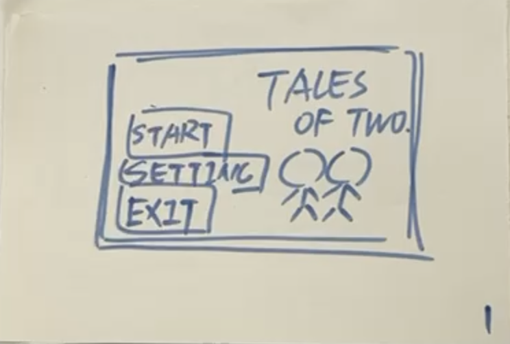

# Software Engineering - Group 15

## Team

Yining Xu, Li-Hshin Chien, Ada Liang, Louis Nutt-Wilson, Xinyu Hu

# Requirements

## Stakeholders

* Users of the game
* The friends of the users of the game
* The markers of the project
* Future groups next year
* 
## User Storeies

"As a player, I want to have personalize choices at the start of the game so that I can choose the game's difficulty based on my preferences."

"As a player, I want to gain resources through some special behviours in the game, and these resources can be able to trade for special skills, so it is bit more fun."

"As a player, I want to know the force and the direction of my arrow, so I need a sign to acknowledge that."

"As a second player, I want to be able to play the game with my friends, so that I can have fun with two players other than play against the computer."

"As a player, I want to have cases or tutorial examples telling me some of special designs of the game."

"As a player, I want a skip function to skip the animation, so that I can get the result immediately."

"As a marker for this project, I want to see groups create engaging and well made games, with a strong process of development that utilises the techniques taught in this module."

"As a future group for this module, we want to see good examples of games which will inspire us when creating our own game."

## Use-case diagram

## Use-case specifications

**Use-Case Specification**

*Easy Mode*

| Use-Case Section     | vs Human                                                                                                                                                                   | vs Computer   |
|----------------------|----------------------------------------------------------------------------------------------------------------------------------------------------------------------------|----|
| **Description**      | A run through of the game on easy mode                                                                                                                                     | A run-through of the game on easy mode, against a computer |
| **Basic Flow**       | Two players compete to get a higher score to win the game with no one losing all of his health points.                                                                     | The player and the computer compete to get a higher score to win the game, with neither losing all of their health points. |
| 1.                   | Each user presses the left mouse button, drags the mouse to determine the strength and direction, and releases the mouse to shoot. Each player can take one shot each turn. | The player presses the left mouse button, drags the mouse to determine the strength and direction, and releases the mouse to shoot. The player and the computer can take one shot each turn. The actions of the computer in these aspects are automated. |
| 2.                   | The user who is shot will lose his health points.                                                                                                                          | The player and the computer lose health points when shot. |
| 3.                   | The users can collect weapons and skills by shooting the stars.                                                                                                            | The player can collect weapons and skills by shooting the stars, while the computer's actions are automated. |
| 4.                   | The users can adjust their position by pressing A and D.                                                                                                                   | The player can adjust position by pressing A and D, and the computer will automatically make adjustment of its position. |
| 5.                   | The number of rounds will decrease after each user takes a shot.                                                                                                           | The number of rounds will decrease after each side takes a shot. |
| 6.                   | The number of rounds decrease to 0 and the result is shown with the option to try again.                                                                                   | The number of rounds decrease to 0 and the result is shown with the option to try again. |
| **Alternative Flow** |                                                                                                                                                                            |    |
| 1.                   | Each user presses the left mouse button, drags the mouse to determine the strength and direction, and releases the mouse to shoot. Each player can take one shot each turn. | The player presses the left mouse button, drags the mouse to determine the strength and direction, and releases the mouse to shoot. The actions of artificial intelligence in these areas are automated. The player and artificial intelligence can take one shot each turn. |
| 2.                   | The user who is shot will lose his health point.                                                                                                                           | The player and the computer lose health points when shot. |
| 3.                   | The users can collect weapons and skills by shooting the stars.                                                                                                            | The player can collect weapons and skills by shooting the stars, while the computer's actions are automated. |
| 4.                   | The users can adjust their position by pressing A and D.                                                                                                                   | The player can adjust position by pressing A and D, and the computer will automatically make adjustment of its position. |
| 5.                   | The number of rounds will decrease after each user takes a shot.                                                                                                           | The number of rounds will decrease after each side takes a shot. |
| 6.                   | The user has lost all of his health points within 10 rounds and the result is shown with the option to try again.                                                          | The player has lost all of the health points within 10 rounds and the result is shown with the option to try again. |

*Difficult Mode*

| Use-Case Section                        | vs Human                                      | vs Computer                                                                                                     |
|-----------------------------------------|-----------------------------------------------|-----------------------------------------------------------------------------------------------------------------|
| **Description**                         | A run through of the game on hard mode        | 1 player run through of the game on hard mode, against a computer                                               |
| **Basic Flow**                          | Shoot your opponent until his/her HP becomes zero                    | Shoot the computer until its HP becomes zero, or your own becomes zero                                          |
| 1.                                      | Players can choose their own planet, each planet has different gravity | Players can choose their own planet, each planet has different gravity                                          |
| 2.                                      | LEFT-CLICK and drag the mouse to control throwing power and angle (User can choose to hit the star or opponent) | LEFT-CLICK and drag the mouse to control throwing power and angle (User can choose to hit the star or opponent) |
| 3.                                      | May appear strong wind and change the trajectory of the arrow         | ay appear strong wind and change the trajectory of the arrow                                                    |
| 4.                                      | Hit opponent, their HP will be reduced [A1, A2, A3]                    | Hit opponent, their HP will be reduced [A1, A2, A3]                                                             |
| 5.                                      | Change sides                                  | Change sides, computer will take their turn                                                                     |
|                                         |                                               |                                                                                                                 |
| **Alternative Flow**                    |                                               |                                                                                                                 |
| A1                                      | 1. Hit a star, skill points will increase                                |                                                                                                                 |
|                                         | 2. Back to Basic Flow 5.                    |                                                                                                                 |
| A2                                      | 1. Hit a star, star becomes black hole                                    |                                                                                                                 |
|                                         | 2. No skill points will be added                                       |                                                                                                                 |
|                                         | 3. Back to Basic Flow 5.                    |                                                                                                                 |
| A3                                      | 1. Hit the ground                            |                                                                                                                 |
|                                         | 2. The ground breaks                        |                                                                                                                 |
|                                         | 3. Back to Basic Flow 5.                    |                                                                                                                 |
=======

* vs Human or vs Computer

* then settings screen
    * choose how many rounds you want to play
    * how much health each player should have
    * the number of planets

* Points system + shop
* Gravity planets; choosing between moon, mars, earth, etc.
* Interactive terrain (destroyable by certain items in the shop ? )
* solar wind ? like in TANKS, raft wars
* black holes ?

* shooting stars mechanics
    * probabilities to do certain things
    * turn into a planet/black hole (which can be turned off in the settings)
    * gaining points etc

* camera zooms in on the following of an arrow
* whether to do a half and half screen where one side has negative gravity, or multiple planets completely visible on the screen

* player can move around the planet rather than shoot for a move
* moving to other planets ? maybe an item in the shop
* HP bars and blood
* Targets on other planets which give points when shot

* Final screen: player X wins

## Game idea 1 - 2 player cooperative game

It is a game involving both puzzles and actions. Similar to this part "Ice and Fire" of "It takes two" gameplay, but make it 2D.
https://www.youtube.com/watch?v=LaLqVvRAuSA
* The main plot is: the mage twins receive a quest to find the kingdom's hidden treasure, a task that requires them to traverse through fields imbued with fire and ice. It the story can be told by giving the players a few slides at first (kinda like the start of HELLTAKER).
  
* the first room should be a tutorial room, with simple instructions and punching bags for players to try how to manipulate.
* the second big room can be a field with environmental interaction(the players can figure out puzzles together and use their specialty to solve it) and of course there are some Minion to beat.
  
* the third room can be "BOSS ROOM", the twins finally get to the treasure, but first they are going to beat a giant dragon first...(by the way, The BOSS can switch between ice and fire attributes)

### The twist
It is a game with interations with the environment(puzzles) and BOSS fight. especially as the mage twins finally approach the treasure in the 'BOSS ROOM,' they discover that the giant dragon guarding it has the ability to not only switch between ice and fire attributes but also to merge these elements

### Challenges
### Challenge 1: Environmental Interaction
Make the ice and fire elements interact with the environment differently. For instance, in the fiery domain, players might need to utilize flames to propel mechanisms, while in the icy realm, they may have to freeze bodies of water or use ice to create pathways.

### Challenge 2: Multiple players
We aim to encourage players to collaborate with each other and leverage the unique strengths of their characters.

### Challenge 3: Actions
So...there should be "Attack Range Detection" and he teams should come up with a method to calculate the mathematical relation among Boss HP, attack damage and attributes.
And after being attaked, the players' HP should also be calculated.

**To be discussed...**

https://www.youtube.com/watch?v=Hmw73vcUzsg&list=PLqPLyUreLV8C59RyVDRESJtefspPi-eXq

Should we make the game undertale-like or the mario-like

### Prototype

## Game Idea 2 - 2 player versus game

* A classic turn based 2d game, in the style of old flash games such as Raft Wars, Bowman, Fleabag and Mutt, etc.

### Twist idea
* Set in space, with each player located on a different planet. This would mean that each player would have to account for gravity and other planets when they shoot!

### Challenges
  * **Camera movement**; in bowman and raft wars, the camera moves with the projectile so the shooting player cannot see exactly where they need to hit
  * **Gravity engine**; Gravity mechanics would need to be implemented for this idea (if it is set in space) and the balance between realism and difficulty would need to be found
  * **AI enemy**; allowing a single player to fight against a computer would add more depth to this game, and it would pose a challenge to create the computer player.
<<<<<<< HEAD

### Prototype

>>>>>>> 1363295 (test)
